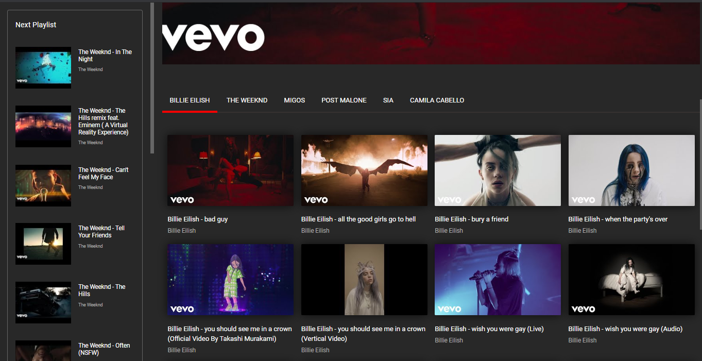

# YT Hook

<a href="https://ythook.marraine.co/"></a>

Hook is a simple Youtube playlist library that uses multiple playlist IDs to display videos in sequence. It requires 2 different playlist ids on a single page.
Example: 

``mainPlayListId``: the main playlist for that specific page

``nextPlayListId``: the next playlist from the upcoming page.

---
## 🚀 Demo

#### 👉 [See demo on the official site](https://ythook.marraine.co/)
----

## 🤔 How to use it?
Add styles in `<head>`
```html
<link href="https://ythook.marraine.co/css/hook.css" rel="stylesheet">
```

Add the scripts right before closing `<body>` tag, and declare your two playlist IDs:
```html
 <script src="https://cdnjs.cloudflare.com/ajax/libs/jquery/3.4.1/jquery.js"></script>
    <script>
    let mainPlayListId = 'playlistID1'
    let nextPlayListId = 'playlistID2'
    </script>
<script src="https://ythook.marraine.co/hook.js"></script>
```

I know, I know, nobody likes jQuery anymore. I promise the next version it won't be jQuery dependent anymore.  

## HTML

Hook uses a pre-defined html structure:

```html
<section class="main-hook">
 <div class="video-holder"></div> 
    <div class="middle-nav">
        <a href="play1" class="isActive">Billie Eilish</a>
        <a href="play2">The weeknd</a>
        <a href="play3">migos</a>
        <a href="play4">Post malone</a>
        <a href="play5">sia</a>
        <a href="play6">camila cabello</a>
    </div>
    <div id="marraine-hook"></div>
</section>
```

To display the next playlist at the left side of the page you'll need to add:

```html
<div class="quickside"></div>
```
at the very top of the 

>section tag

Like this: 
```html
<div class="quickside"></div>
<section class="main-hook">
    <div class="video-holder"></div> 
        <div class="middle-nav">
            <a href="play1" class="isActive">Billie Eilish</a>
            <a href="play2">The weeknd</a>
            <a href="play3">migos</a>
            <a href="play4">Post malone</a>
            <a href="play5">sia</a>
            <a href="play6">camila cabello</a>
        </div>
  <div id="marraine-hook"></div>
</section>
```        

The `class` => `isActive` adds a red line at the bottom of the link on the current page, and should be removed or added following the page sequence.

## Initialize Hook?
No need to initialize Hook, it has already been initialized. 


## ❔Have Questions?

If you found a bug, have a question or an idea, please don't hesitate to create new issues.


